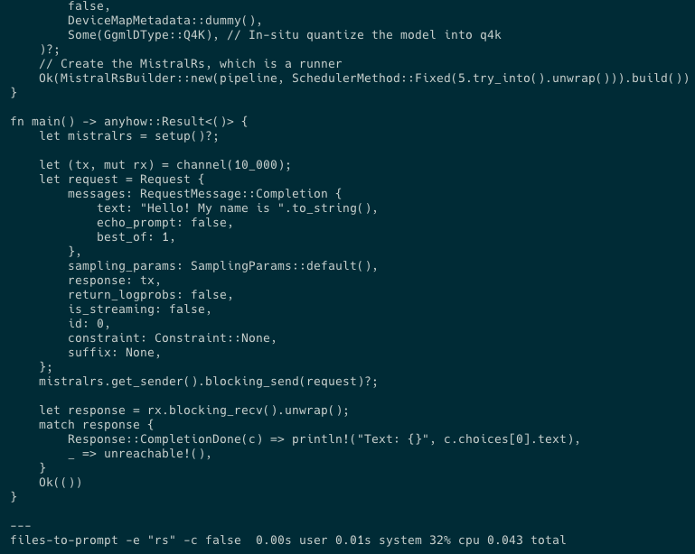
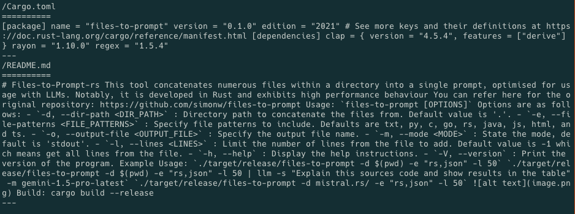

# Files_to_Prompt

Provice a list of files to prompt and explain the content of the files.

## Brief description

Directory File Processor is a Rust-based command-line tool that recursively traverses directories, filters files based on specified extensions and criteria, processes their content, and renders the result using customizable templates.

## Features

- Recursive directory traversal
- File filtering based on extensions
- Configurable file and folder exclusion
- Content processing with regular expressions
- Output rendering using customizable templates
- Multi-threaded processing for improved performance
- Support for file-based and standard output

## Installation instructions

To install the Directory File Processor, follow these steps:

1. Clone the repository:

   ```sh
   git clone https://github.com/yourusername/directory-file-processor.git
   cd directory-file-processor
   ```

2. Build the project using Cargo:

   ```sh
   cargo build --release
   ```

3. The executable will be located in the `target/release` directory.

## Usage examples

### Basic Usage

To perform a traversal of the current directory and process all `.rs` files:

```sh
./target/release/directory-file-processor
```

### Specify Directory and File Extensions

To specify a different starting directory and file extensions:

```sh
./target/release/directory-file-processor --dir_path /path/to/dir --file_patterns "rs,txt"
```

### Output to a File

To save the output to a specific file:

```sh
./target/release/directory-file-processor --output_file output.txt
```

### Limit Number of Lines Processed

To limit the number of lines processed from each file:

```sh
./target/release/directory-file-processor --lines 50
```

### Clean Input Before Processing

To clean the input using regular expressions before processing:

```sh
./target/release/directory-file-processor --clean_input_enabled true
```

### Ignore Specific Files and Folders

To ignore specific files and folders:

```sh
./target/release/directory-file-processor --ignore_files "file1.rs,file2.txt" --ignore_folders "folder1,folder2"
```

### Use Custom Template

To use a custom template for rendering the output:

```sh
./target/release/directory-file-processor --template custom_template
```

### List Available Templates

To list all available templates:

```sh
./target/release/directory-file-processor --list_templates
```

## Configuration options

You can configure Directory File Processor using the following command-line arguments:

- `--dir_path`: Starting directory for the traversal (default: `.`).
- `--file_patterns`: Comma-separated list of file extensions to process (default: `txt,py,c,go,rs,java,js,html,ts`).
- `--output_file`: Path to the output file (default: empty, meaning standard output).
- `--lines`: Limit the number of lines to process from each file (default: `-1`, meaning no limit).
- `--clean_input_enabled`: Enable cleaning of input using regular expressions (default: `true`).
- `--files`: Optional list of specific files to process.
- `--ignore_files`: Comma-separated list of file names to ignore.
- `--ignore_folders`: Comma-separated list of folder names to ignore.
- `--template`: The template file to render the output (default: `default`).
- `--list_templates`: List all available templates.

## Contribution guidelines

We welcome contributions to improve Directory File Processor! To contribute:

1. Fork the repository.
2. Create a new branch with a descriptive name.
3. Make your changes and test them thoroughly.
4. Commit your changes with a clear commit message.
5. Push your changes to your forked repository.
6. Submit a pull request to the main repository.

Please ensure your code adheres to the existing coding standards and passes all tests.

## Testing instructions

You can test Directory File Processor by running:

```sh
cargo test
```

This command will execute all unit tests and integration tests defined in the codebase.

# Example Usage:

`./target/release/files_to_prompt -d $(pwd) -e "rs,json" -l 50`

`./target/release/files_to_prompt -d $(pwd) -e "rs,json" -l 50 | llm -s "Explain this sources code and show results in the table" -m gemini-1.5-pro-latest`

`./target/release/files-to-prompt -d mistral.rs/ -e "rs,json" -l 50`


# Support multiple files:

`./target/release/files-to-prompt -f Cargo.toml -f README.md`


# Build:

cargo build --release

## License

This project is licensed under the MIT License. See the [LICENSE](LICENSE) file for details.

## Acknowledgements/Credits

This project uses the following libraries and tools:

- [Clap](https://github.com/clap-rs/clap) for command-line argument parsing
- [Rayon](https://github.com/rayon-rs/rayon) for data parallelism
- [Regex](https://github.com/rust-lang/regex) for regular expression support
- [Tera](https://github.com/Keats/tera) for template rendering
- [Rust-embed](https://github.com/pyros2097/rust-embed) for embedding assets

Special thanks to all the open-source contributors and the Rust community for their valuable work.
